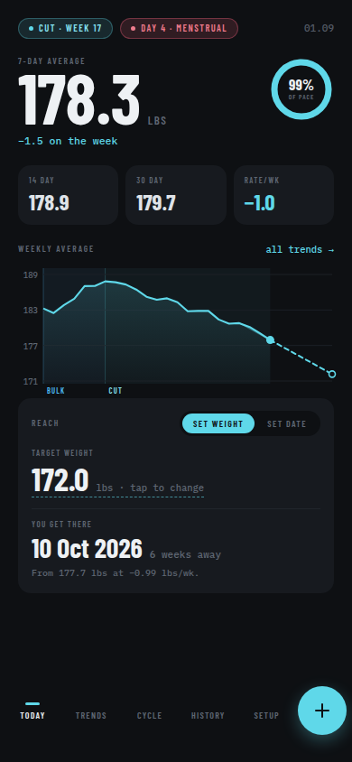
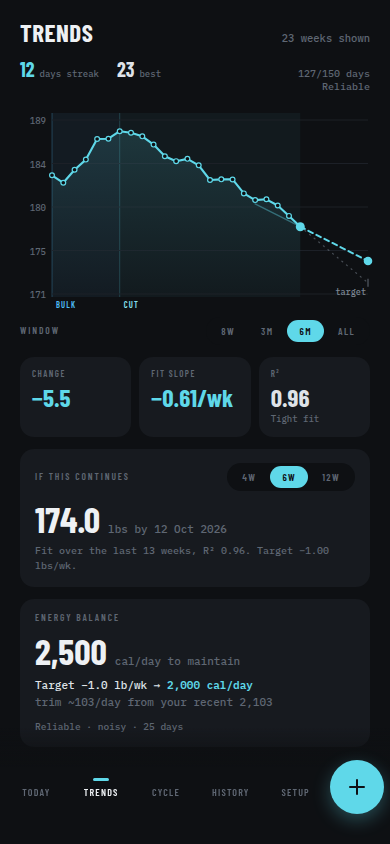
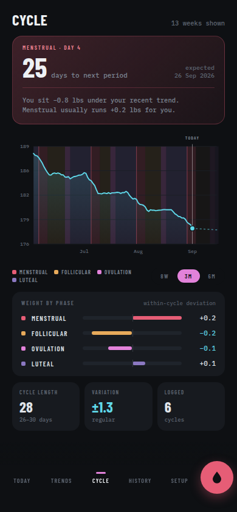
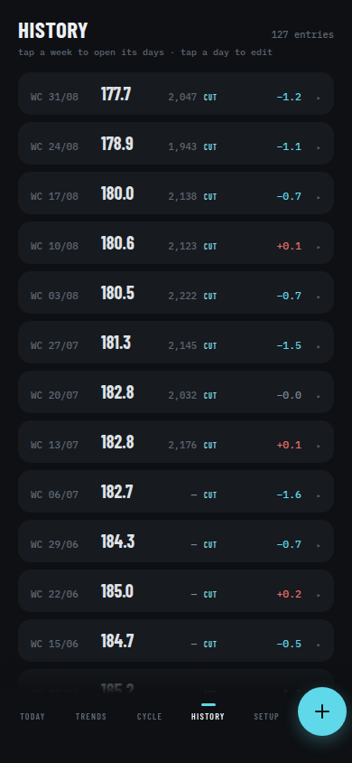
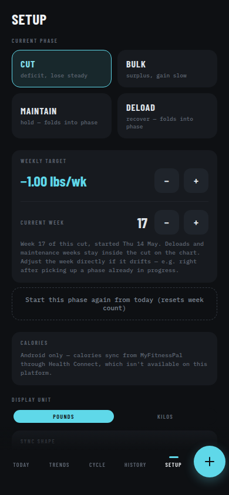

# Weight &amp; Cycle Tracker

A single-purpose tracker for someone running cut/bulk cycles who also wants their weight read
against their menstrual cycle. Log a weigh-in in one tap, judge progress by the 7-day rolling
average (not the noisy daily number), see weekly averages plotted with a line of best fit, and
ask "if this continues, when do I hit X?" in both directions — set a target weight and get a
date, or set a date and get a projected weight. A separate Cycle screen shades the weight line
by menstrual phase and learns each phase's typical water-weight swing, so a luteal bump reads as
water rather than fat. On Android it also pulls daily calories from Health Connect and runs an
adaptive-TDEE maintenance estimate.

Ships as a web PWA and as a native Android app via Capacitor.

<p align="center">
  
  
  
  
  
</p>

## Features

- **Weigh-in** — one-tap keypad entry for today (or any past day). The headline number is the
  7-day rolling average; a pace ring compares this week's rate to the target, and Today also
  shows 14/30-day averages, current rate, logging streak and window completeness.
- **Trends** — weekly averages as inline SVG with a least-squares fit line. The fit is scoped to
  the current training phase so a wide window never blends a bulk and a cut into one slope. The
  fit and its forward projection are one continuous line; a second line shows the target pace.
- **Reach solver** — bidirectional. Set a target weight → get a calendar date and week count;
  set a number of weeks → get a projected weight. Reports "flat" or "unreachable" when the
  trend doesn't support an answer.
- **Training phases** — a Cut/Bulk/Maintain/Deload log. Maintain and Deload weeks fold into the
  enclosing Cut/Bulk span (so the direction persists) but are marked on the chart on their own
  week. Chart bands and the fit both follow this log.
- **Cycle** — log a *period start* (end optional); everything else is derived. Current phase and
  cycle day, days to next period, median cycle length (median of the last six start-to-start
  gaps, clamped to 21–40 days) and a regularity read. The weight chart is shaded into
  Menstrual / Follicular / Ovulation / Luteal bands with a 14-day forward prediction.
  **Weight by phase** de-trends each completed cycle by its own least-squares fit, then buckets
  the daily residuals by phase — the result is a per-phase water-weight signature, and the
  status card uses it to interpret where today's weight sits relative to your own trend.
- **Calories / adaptive TDEE** (Android only) — daily calories-consumed totals come from Health
  Connect, which MyFitnessPal writes into. Health Connect only retains ~30 days locally, so each
  day is copied into Supabase (`daily_nutrition`) as durable history. The maintenance estimate
  runs over a 28-day window that never spans a Cut↔Bulk change; it derives a target intake and
  the adjustment needed to hit the weekly rate, using different energy densities for loss
  (3500 kcal/lb) and gain (3100), picked from the logged phase rather than the scale-trend sign.
- **Offline-first** — logging works with no network; writes queue locally and sync when back
  online. A `localStorage` snapshot makes the next boot instant.

## Stack

- **React + Vite + TypeScript**, no router — five screens (`Today`, `Trends`, `Cycle`,
  `History`, `Setup`) switch on a single `screen` field in a React Context + `useReducer` store.
- **Supabase** (Postgres + email magic-link auth) for storage, with a `localStorage` cache and
  an offline write queue in front of it. Single real user; RLS scopes every row to `auth.uid()`.
- **Capacitor** wraps the same web build as a native Android app. A small Kotlin plugin
  (`HealthConnectPlugin.kt`) bridges Health Connect for the calories feature.
- Charts are hand-rolled inline SVG (`src/lib/chartGeometry.ts` + `src/components/chart/`) — no
  charting library.

## Project layout

```
src/
  lib/        pure, unit-tested logic: rolling averages, phase spans, least-squares fit,
              the bidirectional Reach solver, chart geometry, cycle phases, energy/TDEE
  store/      state shape + reducer + the AppContext that wires in persistence/sync
  data/       Supabase client, offline queue, sync, auth gate, Health Connect bridge
  components/ shared UI (nav, chart, entry sheets, ui primitives)
  screens/    Today, Trends, Cycle, History, Setup
tests/        vitest, run against a synthetic 317-day weigh-in fixture (tests/fixtures/weight-data.ts)
supabase/
  migrations/ 0001 schema (entries, phase_log, settings + RLS), 0004 cycle_log, 0005 daily_nutrition
android/      Capacitor-generated native project (appId com.maskwearer.weighttracker)
```

## Local development

```bash
npm install
cp .env.example .env.local   # fill in your Supabase project URL + anon key
npm run dev
```

Without Supabase credentials the app still runs — `AuthGate` falls through to a local-only
session and every `src/data/api.ts` call checks `supabaseConfigured` and no-ops. Fresh installs
boot with no entries (log a weigh-in to get started).

### Database setup

Run the migrations in `supabase/migrations/` in order via the Supabase SQL Editor (or the
Supabase CLI once you're linked to a project). `0001_init.sql` creates the core schema
(`entries`, `phase_log`, `settings`) with RLS; `0004` adds `cycle_log`; `0005` adds
`daily_nutrition`. Every migration is idempotent (`create table if not exists` + upserts).

### Other scripts

```bash
npm test     # vitest — logic tests against the synthetic weigh-in fixture
npm run lint # oxlint
npm run build
```

## Android

```bash
npm run build
npx cap sync android
cd android && ./gradlew assembleDebug
adb install -r app/build/outputs/apk/debug/app-debug.apk
```

Needs a JDK (not just a JRE) and the Android SDK on `$ANDROID_HOME`; `minSdk` is 26,
`targetSdk` 35. The debug APK is unsigned — fine for sideloading to your own device, but a
release build needs a signing key before wider distribution.

Magic-link sign-in on native builds redirects through a custom `weighttracker://login-callback`
URL scheme (see `src/data/AuthGate.tsx` and the intent-filter in
`android/app/src/main/AndroidManifest.xml`) so the email link opens the app instead of a
browser. That URL also needs to be added to the Supabase project's Authentication → URL
Configuration → Redirect URLs allow-list.

The calories feature requests the Health Connect `READ_NUTRITION` permission at runtime and
reads daily dietary-energy totals via `HealthConnectPlugin.kt`. It's Android-only — on web and
iOS the Setup screen just shows "not connected" and the feature stays inert.
